# Credit Score Prediction Project - KNIME

Este proyecto utiliza la plataforma **KNIME** para desarrollar un modelo de predicción del **score crediticio** basado en el conjunto de datos *German Credit Data*. A diferencia de un flujo tradicional programado en Python, KNIME permite acelerar el desarrollo, visualizar fácilmente cada etapa del flujo, y exportar modelos reutilizables en otros entornos (como PMML o ONNX).

---

## Objetivo
Yo misma realicé este proyecto primero desde cero en Python. Después de **3 semanas de trabajo**, logré entrenar un árbol de decisión, obtener su curva ROC y evaluar su rendimiento. Sin embargo, no logré generar **utilidad real** del modelo: no pude exportarlo fácilmente, integrarlo con otros sistemas ni automatizar su funcionamiento.

Aquí viene la motivación de usar KNIME para construir un modelo de clasificación que permita identificar si un solicitante de crédito representa un **riesgo alto o bajo** para una entidad financiera, y poder exportarlo sin problemas.

---

## Herramientas utilizadas

- [KNIME Analytics Platform](https://www.knime.com/knime-analytics-platform)  
- Conjunto de datos: *German Credit Data* (1000 registros, 20 atributos)
- Algoritmo principal: **Training Loan Request**
- Algoritmo de testing: **Deployment Loan Request**
- Exportación del modelo: **PMML**

---

## ⚙️ Estructura del flujo en KNIME

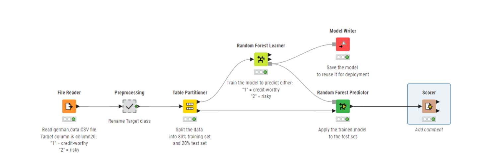

### 1. **Importación de datos**  
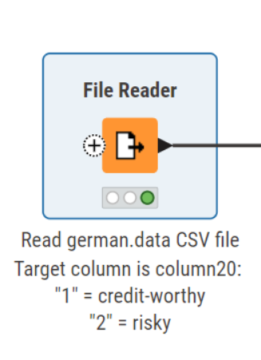

   - Aquí se hace la lectura del conjunto de datos desde archivo `.csv`.
   - Como resultado de este nodo se tiene la visualización de las variables de la data
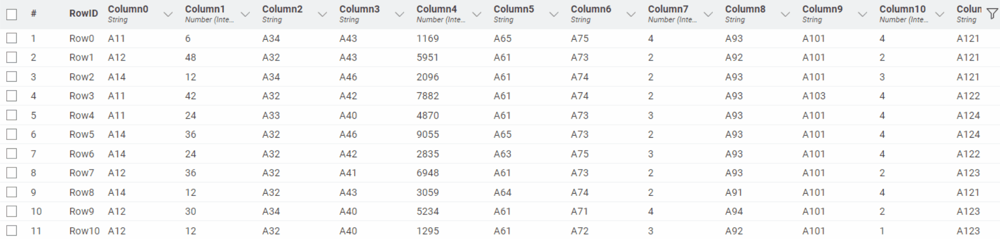

   Nota: Estos datos tienen la característica de ser convertidas en variables categóricas codificadas (A11, A12...) mediante one Hot Encoding para que el modelo pueda procesar de mejor forma este tipo de variables 

### 2. **Preprocesamiento**
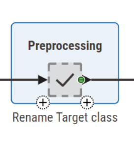

   - Aquí se hace la asignación de la columna 20 como columna Target para que el modelo pueda entrenarse entorno a esta variable, donde :

   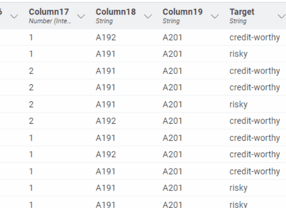

      - "1" = credit-worthy
      - "2" = risky.

### 3. **Partición de datos**
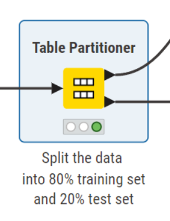

   - En este punto se hace la partición de los datos totales (1000 datos) donde el 80% entrenamiento / 20% prueba
   - El sampling es estratificado para mantener proporción de clases.

### 4. **Entrenamiento del modelo**
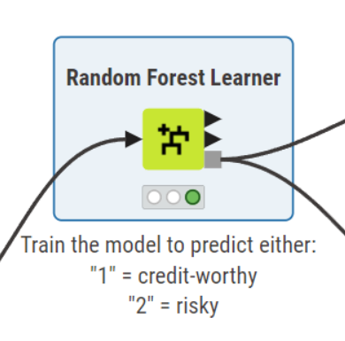

Aquí se hace el entrenamiento del modelo con estas variables:
   - Modelo: `Random Forest Learner`
   - Parámetros clave:
     - Número de árboles: `100`
     - Criterio de partición: `Gini Index`
     - Profundidad máxima: sin límite (por defecto)
     - Random seed: `1234`

Se pueden escoger cierta manualmente las columnas que son necesarias para el entrenamiento, sin embargo para este caso sencillo se tiene en cuenta todas las columnas
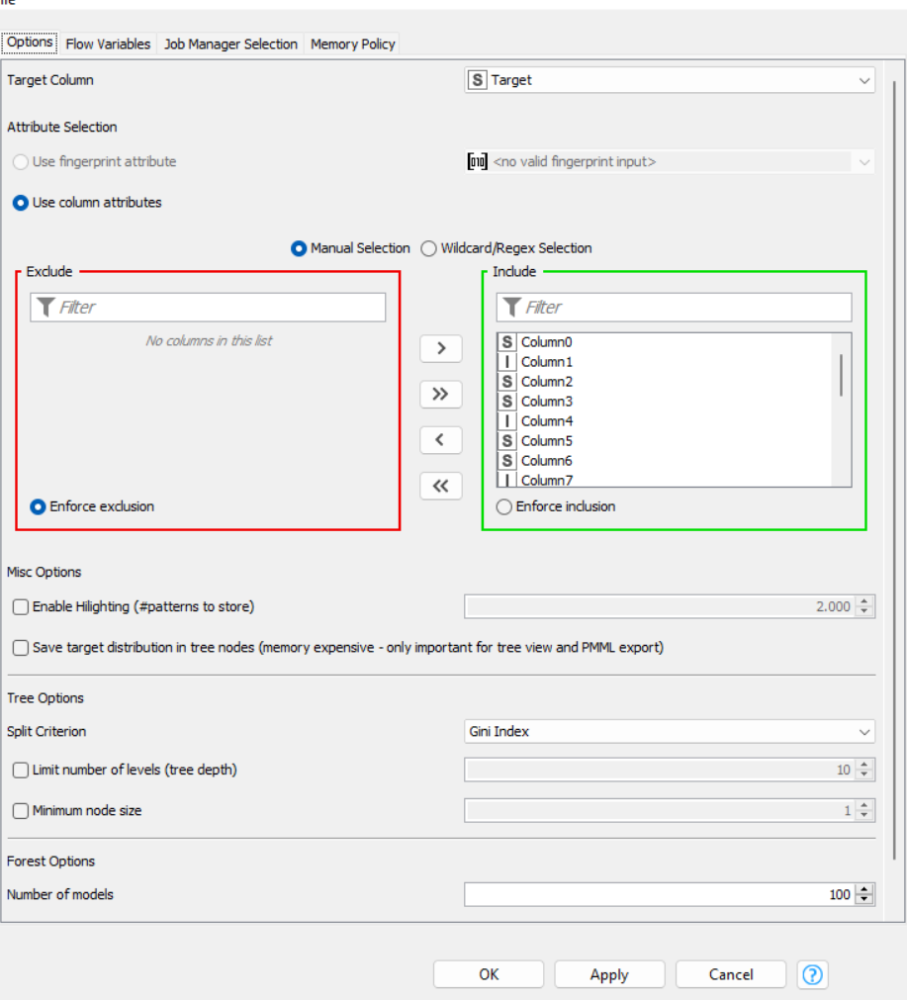

### 5. **Evaluación del modelo**
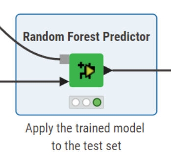

Una vez entrenado el modelo de Random Forest, realizamos la evaluación sobre el 20% de datos de prueba utilizando los siguientes componentes de KNIME:

   - Métricas generadas:
     - `Scorer`: para obtener métricas de clasificación
     - `ROC Curve (Receiver Operating Characteristic)`: para analizar el tradeoff entre sensibilidad y especificidad
     - `Confusion Matrix`: para visualizar errores de predicción

Luego de aplicar el modelo sobre nuevos datos, el flujo de KNIME genera columnas nuevas automáticamente:

| Columna                      | Descripción                                                                 |
|------------------------------|-----------------------------------------------------------------------------|
| `score (prediction)`         | Predicción del modelo (ej. `credit-worthy` o `risky`)                       |
| `score (probability)`        | Probabilidad estimada para cada clase (útil para umbral personalizado)      |
| `score (confidence)`         | Confianza del modelo en su predicción                                       |
| `score (true class)`         | Estado real de los datos                                                      |
| `prediction (correct)`            | Porcentaje predicción                             |

---

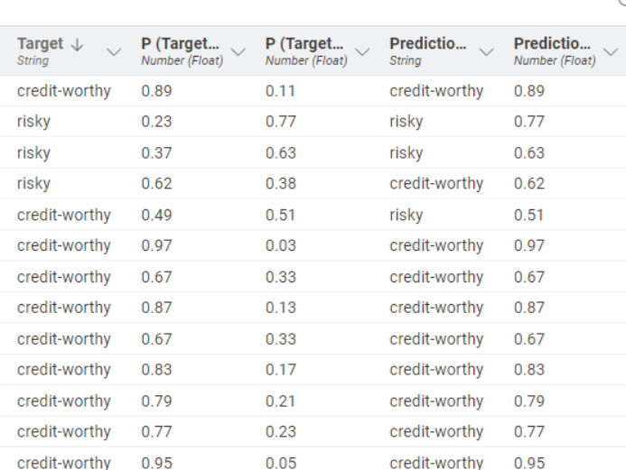

### 6. **Exportación del modelo**
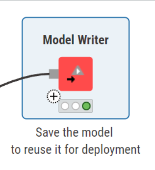

Uno de los mayores beneficios es la exportación del modelo a través de un nodo de **Model Writer**, donde puedo exportar el proyecto usarlo en otros flujos de proyectos KNIME e incluso usarlos en otros proyectos que se necesita un modelo predictivo. 

---

### 7. Prueba de inferencia con el modelo exportado

Para validar que el modelo es **reutilizable fuera del flujo de entrenamiento**, se tiene un miniflujo de prueba que puntúa solicitudes nuevas del día.

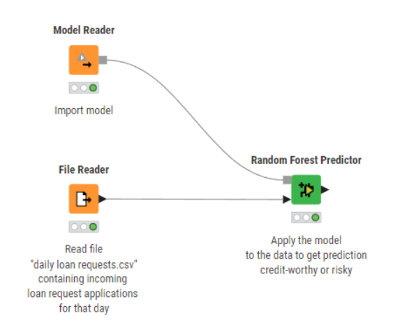

1) **Model Reader**  
   - **Qué hace:** Importa el modelo ya entrenado.  
   - **Formato esperado:**  
     - Si guardaste el modelo con *Model Writer* (formato nativo de KNIME: `.model`), úsalo con **Model Reader** y **Random Forest Predictor**.  
     - Si exportaste **PMML**, usa **PMML Reader** + **PMML Predictor** (equivalente funcional).
   - **Recomendación:** Versiona tu modelo (ej. `model/credit_model_v1.model` o `credit_model_v1.pmml`).

2) **File Reader**  
   - **Qué hace:** Lee el archivo con nuevas solicitudes, p. ej. `data/daily_loan_requests.csv`.  
   - **Requisitos:** El esquema debe **replicar las columnas de entrenamiento** (nombres, tipos y categorías).  
   - **Tips de robustez:**  
     - Agrega un **Missing Value** antes del predictor para cubrir campos faltantes.  
     - Usa **Domain Calculator** si cambian los dominios categóricos.

3) **Random Forest Predictor** (o **PMML Predictor** si usas PMML)  
   - **Qué hace:** Aplica el modelo y genera las predicciones.  
   - **Parámetros clave:**  
     - *Append columns with class probabilities* → habilitado (para tener probabilidades por clase).  
     - *Fail on missing column* → puedes deshabilitarlo si haces manejo de faltantes antes.

## Conclusiones

KNIME facilita el desarrollo de modelos de machine learning para proyectos de analítica aplicada ya que permite:

- Mayor rapidez en la entrega de soluciones.
- Reutilización de modelos en entornos reales.
- Accesibilidad a equipos multidisciplinarios, sin necesidad de programar.

Este enfoque representa una alternativa ideal para proyectos donde se busca **prototipado rápido y despliegue ágil**.
